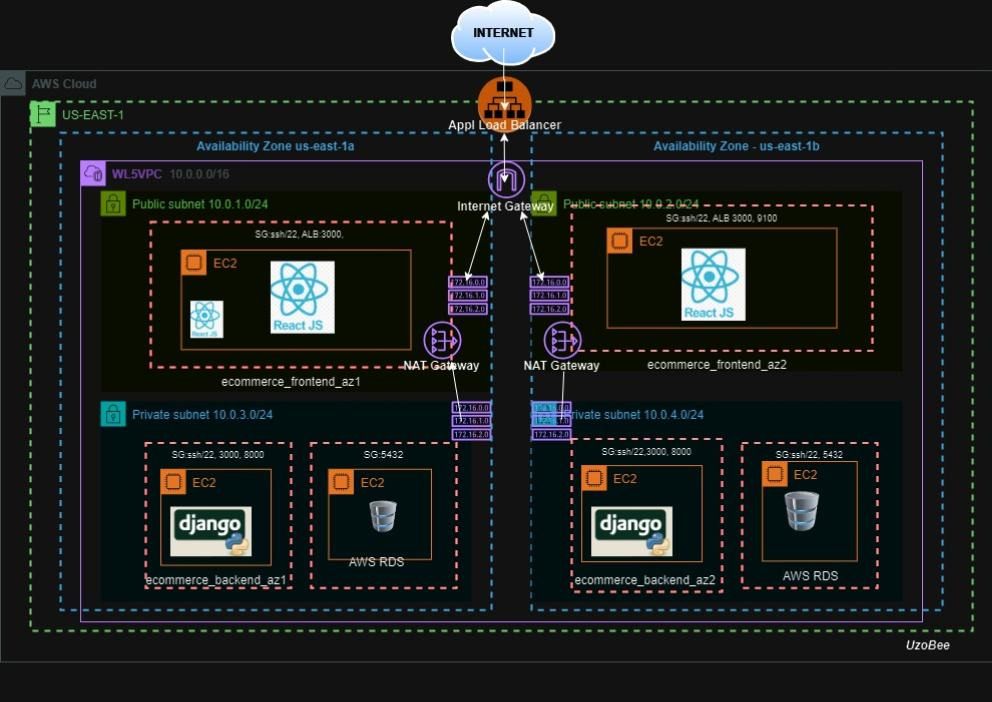

# E-commerce Infrastructure as Code Deployment Documentation

## Purpose
The purpose of this workload is to design and implement a secure, highly available, and fault-tolerant AWS infrastructure for an e-commerce application using Infrastructure as Code (IaC) and CI/CD practices. 

:

* Automating infrastructure provisioning using Terraform
* Deploying a multi-tier application across multiple availability zones
* Implementing proper networking and security controls
* Enabling application monitoring 
* Creating a fully automated deployment pipeline using Jenkins
* Support for business intelligence 

## Summary of Steps Taken
### The infrastructure consists of:
**Infrastructure Setup with Terraform Configuration Files**

- Custom VPC with two Availability Zones
- Public and Private subnets in each AZ
- Application Load Balancer
- Frontend EC2 instances in public subnets
- Backend EC2 instances in private subnets
- RDS database in private subnets
- NAT Gateways for private subnet internet access
- Jenkins/Terraform server for automation
- VPC peering for monitoring server

### Configuring Application Load Balancer
**Purpose**: Provides high availability and fault tolerance
- ALB was created in public subnets
- Health checks configured for frontend instances
- Frontend servers configured as the target groups
- Implemented listener rules for traffic distribution

###  Database Setup
**Purpose**: Secure and reliable data storage
- PostgreSQL RDS instance deployed in private subnets
- Subnet groups were created across 2 AZs

### CI/CD Pipeline Implementation
**Purpose**: Automating deployment process
- Jenkins pipeline stages include:
  - Build: Compiles and packages application
  - Test: Runs unit tests
  - Init: Initializes Terraform
  - Plan: Creates execution plan
  - Apply: Deploys infrastructure
- Implemented secure credential management using Jenkins secrets
- Created user data scripts to configure application on the instances

### Monitoring 
**Purpose**: Ensuring system observability
- Deployed monitoring instance in default VPC
- Configured Node Exporter for metrics collection

## Technology Stack:

* AWS Services:
	EC2 (t3.micro instances)
	VPC and networking components
	Application Load Balancer
	RDS (db.t3.micro)
	NAT Gateways
	Internet Gateway
	Security Groups
	IAM for access management

* React:  frontend for a responsive user interface
	Framework: React.js
	Runtime: Node.js
	Package Manager: npm

* Django: backend for business logic
	Framework: Django (Python)
	Python Version: 3.9

* PostgreSQL: for data storage ( AWS RDS)
	
* Terraform :  for infrastructure provisioning
* GitHub for version control
* Jenkins: for automated deployments
* Node Exporter, Prometheus and Grafana:  for monitoring

## Issues/Troubleshooting

### 1. RDS Connectivity

Issue: Backend couldn't connect to the RDS initially. 
RDS endpoint configuration,  
Security group permissions
Resolution: I updated security group rules and added environment variables
Lesson learned: Verify all security group rules and network paths

### 2. Frontend-Backend Communication

Issue: Frontend couldn't reach backend services
Resolution: Properly updated proxy settings and ALLOWED_HOSTS configuration
Lesson learned: Document all application configuration requirements

### 3. Networking Configuration
* VPC peering configuration for monitoring access
* NAT Gateway setup for private subnet internet access
* Security group rule management

## Optimization Opportunities

### 1. Infrastructure can be optimized to use
* Auto-scaling groups for dynamic scaling
* Make use of AWS Secrets Manager to store sensitive data

### 2. Security
* Implement WAF to add another layer of protection to the application
* Enable AWS services for threat detection and the preventions of Ddos attacks.

## Conclusion
Workload 5  optimized WL4  by using Infrastructure as Code with Terraform and Jenkins. Terraform enabled the automated, repeatable, version-controlled deployment of the infrastructure while the Jenkins multi branch pipeline ensured the automated application deployment.

The Strengths of the architecture :

- High availability through multi-AZ deployment
- Fault tolerance with the inclusion of application load balancers
- Security through proper network segmentation and access controls
- Automation through CI/CD and Infrastructure as Code
- Observability through monitoring 
- Business intelligence through database access
